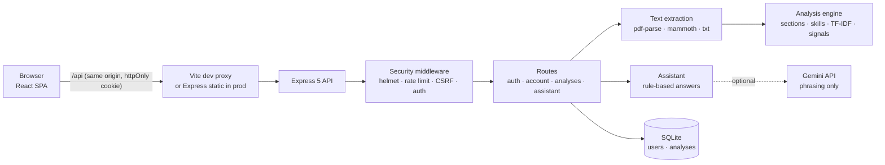

# Architecture

## Overview



Deterministic code decides every fact and score. Gemini, when enabled, only rephrases an answer that was already
built from the stored analysis, and the rule-based answer is used if Gemini fails.

## Folder structure

```
ai resume analyzer/
├── index.html, vite.config.ts, tailwind.config.js, postcss.config.js, tsconfig.json
├── package.json                  pinned dependencies and scripts
├── .env.example
├── src/                          FRONTEND (React + TS)
│   ├── main.tsx, index.css, App.tsx
│   ├── lib/api.ts                typed fetch client (adds CSRF header, maps errors)
│   ├── lib/utils.ts              cn() class helper
│   ├── hooks/useAuth.ts          session restore / login / signup / logout
│   ├── types/index.ts            shared data types (mirrored in server/src/analysis/types.ts)
│   └── components/
│       ├── ui/                   shadcn-style primitives (button, card, input, label, textarea, badge, progress, switch, scroll-area)
│       └── *Page.tsx, Sidebar.tsx
├── server/                       BACKEND (Express + TS, run with tsx)
│   ├── src/
│   │   ├── index.ts              process entry: open DB, listen, graceful shutdown
│   │   ├── app.ts                createApp(db): middleware, routers, static files, error handler
│   │   ├── config.ts             zod-validated environment config
│   │   ├── db.ts                 node:sqlite connection + schema
│   │   ├── http.ts               HttpError, handler(), parseBody()
│   │   ├── middleware/           auth.ts (requireAuth), security.ts (helmet, CSRF, rate limits)
│   │   ├── security/             password.ts (scrypt), session.ts (JWT cookie)
│   │   ├── routes/               auth.ts, account.ts, analyses.ts, assistant.ts
│   │   ├── analysis/             extract, sections, skills, signals, tfidf, redact, analyze, types
│   │   └── assistant/            engine.ts (rules), gemini.ts (optional phrasing)
│   ├── tests/                    node:test suites + synthetic fixtures
│   └── data/                     SQLite DB + dev secret (git-ignored, created at runtime)
└── docs/
```

## Request flow: New Analysis

1. `AnalysisPage` checks the extension and size for fast feedback, then POSTs `multipart/form-data` to `/api/analyses`.
2. `apiLimiter` → `express.json` → `cookieParser` → `csrfProtection` → `requireAuth` → `analysisLimiter` → `multer`
   (memory storage, 5 MB cap).
3. `extractText` checks the file signature against the extension, runs a zip-bomb precheck for DOCX, parses the
   text (up to 20 PDF pages) and normalises it.
4. `analyze()` builds the result (see [SCORING.md](SCORING.md)) and applies privacy-mode redaction.
5. The result JSON and summary columns go into `analyses`. **The uploaded file bytes and full text are not stored.**
6. The frontend shows `ResultsPage`. The Roadmap, Assistant and Progress pages read the same stored result.

## Session flow

- Sign up or log in → server verifies the password → signs an HS256 JWT `{sub, tv}` → sets the `s2h_session` cookie
  (`HttpOnly; SameSite=Strict; Path=/api; Secure` in production).
- Every authenticated request verifies the JWT and loads the user. `tv` (token version) must match
  `users.token_version`; bumping it (password change, logout-all) revokes every other session.
- On page load `useAuth` calls `GET /api/auth/me` to restore the session.

## Database schema

```sql
users(
  id TEXT PK, name TEXT, email TEXT UNIQUE COLLATE NOCASE, password_hash TEXT,
  token_version INTEGER, privacy_mode INTEGER, notifications INTEGER, created_at TEXT, updated_at TEXT)

analyses(
  id TEXT PK, user_id TEXT FK→users ON DELETE CASCADE, resume_name TEXT, jd_title TEXT,
  overall_score REAL, strong_count INTEGER, partial_count INTEGER, missing_count INTEGER,
  result_json TEXT, created_at TEXT)
INDEX idx_analyses_user_created(user_id, created_at DESC)
```

Deleting a user cascades to their analyses. There are no migrations yet: the schema uses `CREATE TABLE IF NOT EXISTS`.

## Frontend ↔ backend contract

`src/types/index.ts` and `server/src/analysis/types.ts` define the same `AnalysisResult` shape. Compared with the
original frontend, `AnalysisResult` gained `id`, `notAssessed` and `engineVersion`, and `ProgressEntry` gained `id`
and `resumeName`.
