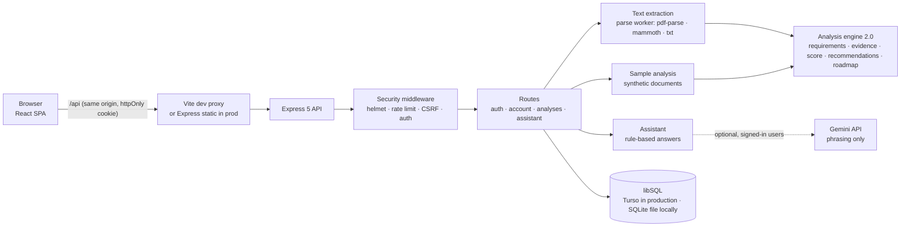

# Architecture

## Overview



Deterministic code decides every fact and score. Gemini, when enabled, only rephrases an answer that was already
built from the stored analysis, and the rule-based answer is used if Gemini fails.

## Folder structure

```
ai resume analyzer/
├── index.html, vite.config.ts, tailwind.config.js, postcss.config.js, tsconfig.json
├── package.json                  pinned dependencies and scripts
├── .env.example
├── src/                          FRONTEND (React + TS)
│   ├── main.tsx, index.css, App.tsx
│   ├── lib/api.ts                typed fetch client (adds CSRF header, maps errors)
│   ├── lib/utils.ts              cn() class helper
│   ├── hooks/useAuth.ts          session restore / login / signup / logout
│   ├── types/index.ts            shared data types (mirrored in server/src/analysis/types.ts)
│   └── components/
│       ├── ui/                   shadcn-style primitives (button, card, input, label, textarea, badge, progress, switch, scroll-area)
│       ├── analysis-ui.tsx       shared status/confidence/requirement chips, quotes, labels
│       └── *Page.tsx, Sidebar.tsx (desktop sidebar, tablet rail, mobile drawer), PreviewBanner.tsx
├── api/index.ts                  Vercel serverless entry: opens the database once per instance, then hands requests to Express
├── server/                       BACKEND (Express + TS, run with tsx)
│   ├── src/
│   │   ├── index.ts              process entry: open DB, listen, graceful shutdown
│   │   ├── app.ts                createApp(db): middleware, routers, static files, error handler
│   │   ├── config.ts             zod-validated environment config
│   │   ├── db.ts                 async libSQL data layer (serialised operations, transactions) + migrations
│   │   ├── http.ts               HttpError, handler(), parseBody()
│   │   ├── middleware/           auth.ts (requireAuth), security.ts (helmet, CSRF, rate limits)
│   │   ├── security/             password(-slots), session (JWT + sessions table), guest, verification, fixed-window, google, email-check
│   │   ├── routes/               auth.ts, account.ts, analyses.ts, assistant.ts, demo.ts
│   │   ├── analysis/             extract, document-parser + parse-worker, docx/pdf guards, sections, skills (taxonomy, RELATED,
│   │   │                         PREREQUISITES), requirements (JD decomposition), signals, tfidf, analyze, recommendations,
│   │   │                         roadmap, weights, demo (synthetic sample), redact, types
│   │   └── assistant/            engine.ts (rules), gemini.ts (optional phrasing), validate.ts, quota.ts
│   ├── tests/                    node:test suites + synthetic fixtures
│   └── data/                     local SQLite DB + dev secret (git-ignored, created at runtime)
└── docs/
```

## Request flow: New Analysis

1. `AnalysisPage` checks the extension and size for fast feedback, then POSTs `multipart/form-data` to `/api/analyses`.
2. `apiLimiter` → `express.json` → `cookieParser` → `csrfProtection` → `requireAuth` → `analysisLimiter` → `multer`
   (memory storage, 5 MB cap).
3. `extractText` checks the file signature against the extension, runs a zip-bomb precheck for DOCX, parses the
   text (up to 20 PDF pages) and normalises it.
4. `analyze()` decomposes the JD, classifies each skill with evidence, scores, and builds recommendations and the
   roadmap (see [SCORING.md](SCORING.md)), applying privacy-mode redaction.
5. The result JSON and summary columns go into `analyses` (guests: `guest_analyses` + `guest_free_use`, in one
   transaction). **The uploaded file bytes and full text are not stored.**
6. The frontend shows `ResultsPage`. The Roadmap, Assistant and Progress pages read the same stored result.

The sample ("Try Demo Analysis") calls `GET /api/demo/analysis` instead: the same `analyze()` on built-in synthetic
documents, returned without being stored.

## Session flow

- Sign up or log in → server verifies the password → creates a `sessions` row → signs an HS256 JWT `{sub, tv, jti}`
  (the row id) → sets the `s2h_session` cookie (`HttpOnly; SameSite=Strict; Path=/api; Secure` in production).
- Every authenticated request verifies the JWT, loads the user, requires `tv` to match `users.token_version`, and
  requires a live `sessions` row with that `jti` for that user. Logout deletes the row; logout-all and password
  change delete all rows and bump the token version.
- On page load `useAuth` calls `GET /api/auth/me` to restore the session.

## Database schema

```sql
users(
  id TEXT PK, name TEXT, email TEXT UNIQUE COLLATE NOCASE, password_hash TEXT,
  token_version INTEGER, privacy_mode INTEGER, notifications INTEGER, created_at TEXT, updated_at TEXT)

analyses(
  id TEXT PK, user_id TEXT FK→users ON DELETE CASCADE, resume_name TEXT, jd_title TEXT,
  overall_score REAL, strong_count INTEGER, partial_count INTEGER, missing_count INTEGER,
  result_json TEXT, created_at TEXT)
INDEX idx_analyses_user_created(user_id, created_at DESC)
```

```sql
-- migration 2
users + email_verified INTEGER, google_sub TEXT (unique when not null)
email_verifications(token_hash TEXT PK, user_id FK→users CASCADE, expires_at INTEGER, created_at INTEGER)
guest_analyses(id TEXT PK, guest_id TEXT, result_json TEXT, claimed_by FK→users SET NULL, created_at TEXT)
```

```sql
-- migration 3 (security remediation P1)
guest_free_use(guest_id TEXT PK, used_at TEXT)            -- claimed guest rows deleted
sessions(id TEXT PK, user_id FK→users CASCADE, created_at TEXT, expires_at TEXT)
assistant_usage(user_id FK→users CASCADE, day TEXT, count INTEGER ≥ 0, PK(user_id, day))
assistant_usage_global(day TEXT PK, count INTEGER ≥ 0)

schema_version(version INTEGER)                            -- created by the migration runner
```

Account deletion deletes the account's analyses, sessions, verification tokens and usage rows explicitly in one
transaction, then the user (the foreign keys still cascade where the connection enforces them). Migrations live in
`server/src/db.ts` and run once each, in a transaction, tracked by the `schema_version` table (a local file created
before it existed is seeded from `PRAGMA user_version`). Append new ones; never edit a released migration.

## Data layer

`openDb()` returns one `Db` for the process (or Vercel function instance) with async `get`/`all`/`run`/`exec` and
`transaction(fn)`. Every operation on a `Db` is queued behind the previous one, because libSQL's local driver can't
run overlapping transactions on one connection; this also keeps check-then-write sections atomic within an instance,
and write transactions keep them atomic across instances on Turso. Rows come back as plain objects with integers as
JavaScript numbers. `db.persistent` is false for `:memory:` and for the Vercel `/tmp` fallback.

## Frontend ↔ backend contract

`src/types/index.ts` and `server/src/analysis/types.ts` define the same `AnalysisResult` shape. Compared with the
original frontend, `AnalysisResult` gained `id`, `notAssessed` and `engineVersion`, and `ProgressEntry` gained `id`
and `resumeName`. Engine 2.0 added `requirements`, `confidence`, `recommendations`, `roadmap`, `demo`, per-skill
`category`/`jdEvidence`/`reason`/`confidence`/`related` and per-component `key`/`contribution`/`confidence`; the
frontend types mark them optional so analyses saved by engine 1.0 still render.

## Responsive layout

| Width | Navigation |
|---|---|
| ≥ 1024 px | Full sidebar |
| 768–1023 px | 64 px icon rail with an expand/collapse button |
| < 768 px | Top bar with a menu button that opens a drawer (Escape or navigation closes it) |

Wide tables (the score breakdown) scroll inside their own container, so pages never scroll sideways.
